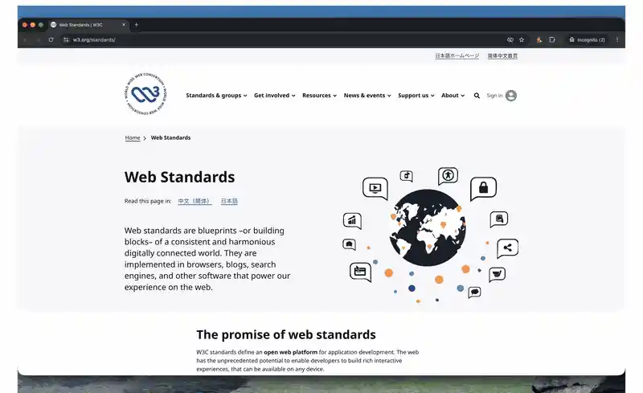

# Style Detective Chrome Extension

A simple CSS property viewer for Google Chrome. Hover any element on a page to inspect its computed styles in a floating panel. Forked from [miled/cssviewer](https://github.com/miled/cssviewer) and modernized.



Features:

- Hover any element to view its CSS properties in a floating panel
- Freeze the panel in place to inspect it
- Copy an element's style to clipboard, or freeze the panel to copy individual property values
- Keyboard shortcut to toggle the viewer (`Ctrl+Shift+D` / `Cmd+Shift+D`)

## Installation

Until a release build is finished, the only way to run this extension is to clone the repo and run:

```bash
npm install
npm run build    # production build → dist/
```

Then open `chrome://extensions`, turn on **Developer mode** (top-right), click **Load Unpacked** and choose the `dist/` directory.

## Usage

Click the toolbar icon (or press `Ctrl+Shift+D` on Windows/Linux/ChromeOS, `Cmd+Shift+D` on macOS) to enable or disable the viewer on the current page. While enabled, hover any element to inspect it.

Keyboard shortcuts while the viewer is active:

- `F` to freeze or unfreeze the panel in place
- `C` to copy a simple CSS definition for the selected element to the clipboard
- `+` / `-` to increase or decrease the panel font size
- `0` to reset the panel font size
- `Esc` to close the viewer

## Known Issues

- The viewer will not activate on tabs that were already open before installation, nor on the Chrome Web Store itself. Reload the tab after installing.
- Styling may occasionally conflict with the web site's CSS
